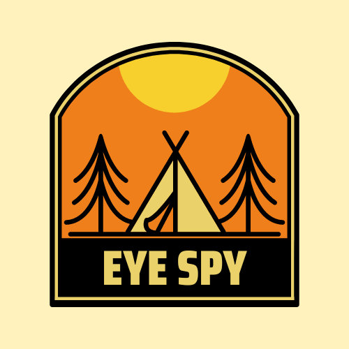

# Eye Spy
### Your Guide to the Outside's Hidden Gems

## Table of Contents
1. [Description](#description)
2. [Motivation](#motivation)
3. [Challenges](#challenges)
4. [Technologies Applied](#technologies)
5. [Future Development](#future)
6. [Documentation](#documentation)
7. [Contributors] (#contributors)
8. [Links](#links)

## Description
Love going outside but hate a crowd?  Then this is your app.  Search the other user's posts to find the perfect spot for your next outing. Sign up and you can share cool new places you've found with others.  If you try a location and like what you see, you share your experience in the comments, and upvote the location.  If you found the location has gotten too much attention and is getting crowded, hit the `too crowded` button.  If too many people feel a place has become too crowded it gets dropped from our site.

## Motivation
One of our team members thought it would be cool to have an app that let you find good places to bicycle or go for a hike that weren't too crowded.  With that, we came up with the idea of a crowd sourced database that automatically dropped locations once they'd become too crowded.

## Challenges

## Technologies Applied
*

## Future Development

## Contributors
* Nathaniel Chan **[nchan22](https://github.com/nchan22)**
* Maggie Joseph, Github: **[maggiejoe](https://github.com/maggiejoe)**
* Leandro Michelena, Github: **[leandromichelena](https://github.com/leandromichelena)**
* Luiz Medina, Github: **[luizmedina87](https://github.com/luizmedina87)**
* Fernando Almeida, Github **[flalmeida3105](https://github.com/flalmeida3105)**
* Eric Smith, Github **[frodrickfronkenstein](https://github.com/frodrickfronkenstein)**

## Links
* **[Repository](https://github.com/CaptainNate/eye-spy)**
* **[Heroku Live App]()**

# 